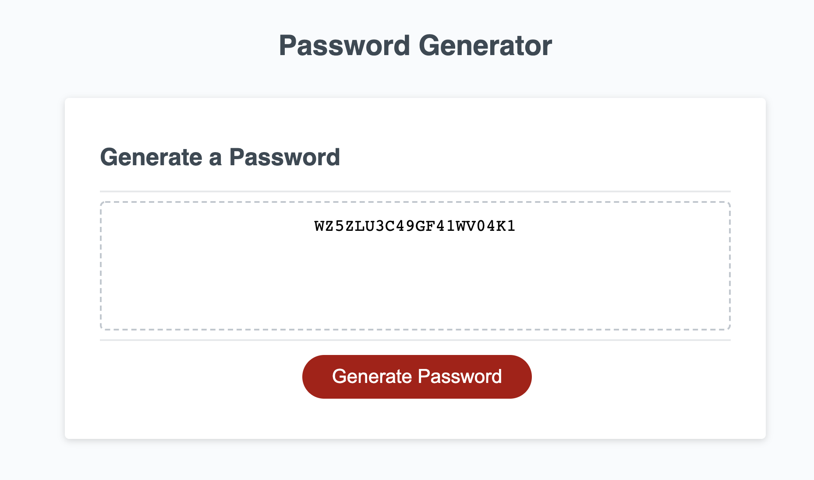

# Password Generator v1

This application has a single function: create a randomized password based on prompts from the user. This randomized password can contain uppercase characters, lowercase characters, numeric characters, and special characters, based on the user's responses. 

## Usage

At the start of the assignment, the web application will look like this: 

Upon clicking the button, alerts will prompt the user to select the types of characters they would like the password to generate. Upon answering all the prompts, a string containing at least one of each type of selected character will be generated and appear in the box. 

The image below shows an example of the functionality of the application after the user says they want a 20 character long password with only uppercase letters and numbers.

## Links

The repo containing the full code can be found [here](https://jhahnsheen.github.io/password-generator-v1/).

Additionally, you can find the application deployed on GitHub pages [here](https://github.com/jhahnsheen/password-generator-v1).

This web application is to be used for educational purposes only. 